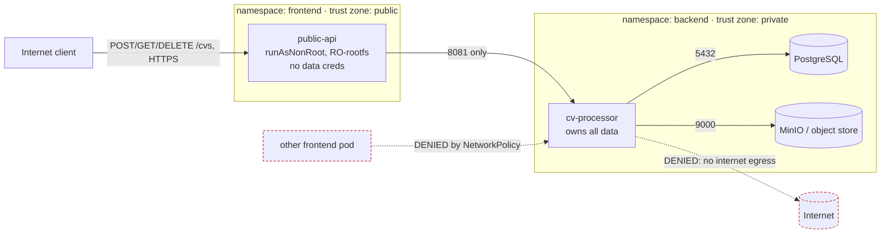
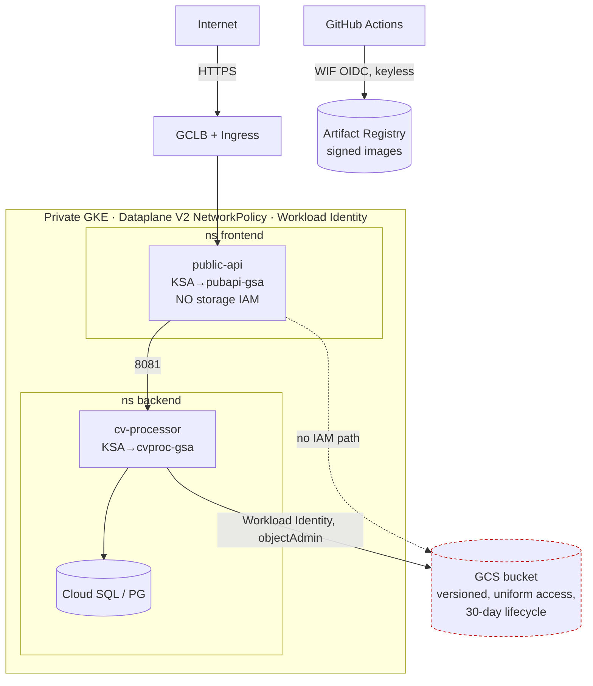

# Architecture & Threat Model

## 1. Overview

Two services with a strict trust boundary between them:

- **`public-api`** (namespace `frontend`, *public* trust zone) — the only
  internet-facing component. Stateless: it validates uploads and proxies to
  `cv-processor`. It holds **no** credentials to data stores and, on GCP, has an
  identity with **no** storage permissions.
- **`cv-processor`** (namespace `backend`, *private* trust zone) — internal only.
  Extracts PDF metadata and owns **all** data: PostgreSQL (metadata) and object
  storage (the PDFs). It is unreachable from the internet and cannot itself reach
  the internet.

The design principle throughout is **least privilege at every layer**: network,
identity, filesystem, and supply chain. A compromise of the public component
yields as little as possible.

## 2. Trust boundaries & data flows (local / kind)

**Boundaries enforced, not just drawn:**

| Boundary | Control |
| --- | --- |
| Internet → only `public-api` | NetworkPolicy `public-api-ingress`; nothing else in `frontend` has an ingress allow |
| `frontend` → `backend` limited to `public-api`→`cv-processor`:8081 | NetworkPolicies `20-public-api` (egress) + `30-cv-processor` (ingress, namespace **AND** pod selector) |
| Only `cv-processor` touches data stores | NetworkPolicies `40-data-backends` (ingress from `cv-processor` only) |
| `cv-processor` cannot reach the internet | `backend` default-deny egress + allow only DNS, Postgres, MinIO |
| Workloads are non-root, read-only, unprivileged | Kyverno `require-hardened-security-context` (enforce) + restricted PSA |
| Only images signed by our CI run | Kyverno `verify-image-signatures` (enforce) |

## 3. Target architecture (GCP / GKE)

Key differences from local: object storage is **GCS** reached via **Workload
Identity** (no keys in the pod); metadata can move to **Cloud SQL**; NetworkPolicy
is enforced by **Dataplane V2**; nodes are private with **Private Google Access**
and a **deny-egress-to-internet** firewall. Secrets come from **GCP Secret
Manager via External Secrets Operator** rather than Sealed Secrets.

### Signature enforcement on GKE: Binary Authorization vs Kyverno
- **Binary Authorization** is GCP-managed, integrates with Artifact Analysis and
  attestors, and enforces at the control-plane admission layer — strong and
  low-maintenance, but GKE-specific.
- **Kyverno** is portable across any cluster and lets us express *both* signature
  and security-context policy in one engine with one policy language.

**Choice:** keep **Kyverno** as the primary, portable control so local and cloud
enforce identically, and **plan Binary Authorization** on GKE as
additional defence in depth (deferred — see ADR 0005). Using only one, we'd
pick Kyverno for portability.

## 4. Threat model

### Threat 1 — Zero-day RCE in `public-api`
An attacker achieves remote code execution inside a `public-api` pod. What stops
lateral movement to `cv-processor`, the database, or the bucket?

| Layer | What the attacker faces |
| --- | --- |
| **Network egress** | `frontend` default-deny egress. The pod may open connections **only** to `cv-processor:8081` and DNS. It cannot scan the cluster, reach Postgres/MinIO directly, or call out to the internet (no C2, no exfil to an external host). |
| **Application boundary** | `cv-processor` exposes only a narrow HTTP API (`/internal/cvs...`). There is no shell, no storage endpoint, and no DB port reachable from `frontend`. |
| **Identity** | On GKE, `public-api`'s KSA maps to `pubapi-gsa`, which holds **no** storage IAM. Even with the metadata server, the attacker gets a token that cannot read the bucket. Postgres/MinIO credentials are simply **not present** in the pod. |
| **Filesystem** | Read-only root filesystem + dropped capabilities + non-root + no privilege escalation → no persistence, no tool drop into system paths, no container breakout via capabilities. |
| **Token** | `automountServiceAccountToken: false` → no Kubernetes API token to abuse. |
| **Blast radius** | Worst case: the attacker can call the same `cv-processor` API a legitimate `public-api` can — i.e. upload/read/delete CVs through the front door — but cannot reach data stores directly, cannot exfiltrate to the internet, and cannot move laterally. |

**Residual risk & next step:** the attacker can still exercise `cv-processor`'s
API. Mitigations to add: per-request authn between the services (mTLS via a mesh
or signed service tokens), rate limits, and anomaly alerting on `cv-processor`
call patterns.

### Threat 2 — Malicious pull/merge request
A contributor (or a compromised fork) opens a PR that tries to (a) steal the CI
runner's cloud credentials, or (b) tamper with published images.

| Vector | What stops it |
| --- | --- |
| **Exfiltrating cloud creds** | There are **no static cloud keys** to steal — GCP auth is Workload Identity Federation, and the OIDC token is only minted for `push` events on our repo/branch, not for fork PRs. The `attribute_condition` on the WIF provider rejects any other repository. |
| **PR from a fork reading secrets** | `pull_request` runs from forks get **no repository secrets** and no `id-token`. The `build-sign` and `cloud-auth-demo` jobs are guarded `if: github.event_name == 'push'`, so a fork PR can only run scans, never publish or authenticate. |
| **Tampering with images** | Publishing requires `packages: write` + `id-token: write`, granted only on trusted `push`. Images are **keyless-signed** by the CI identity; Kyverno admits **only** images signed by exactly our issuer+workflow subject, so an unsigned or differently-signed image is rejected at deploy time. |
| **Supply-chain injection via a tampered action** | Third-party actions are **pinned by commit SHA** (a moved tag can't swap code in), maintained by Dependabot, and a `pinning-check` job fails the build on any unpinned use. |
| **Malicious dependency / secret in the diff** | SAST (Semgrep), SCA (Trivy), secret scanning (Gitleaks, full history), and IaC scanning gate every PR before merge. |

**Residual risk & next step:** a maintainer with merge rights remains trusted;
add branch protection with required reviews, `CODEOWNERS`, and required status
checks so no single actor can merge to `main`.

## 5. Defence-in-depth summary
Network (default-deny + explicit allows) · Identity (Workload Identity, no keys,
public-api has no storage) · Workload (non-root, RO-rootfs, drop caps, no token)
· Admission (Kyverno enforce: signatures + security context) · Supply chain
(scan gates, SBOM, keyless signing, SHA-pinned actions) · Data (sealed/managed
secrets, versioned encrypted bucket, GDPR lifecycle).

## 6. Delivery model: GitOps (pull) vs CI-push

Deployment to GKE is **pull-based GitOps** (Argo CD), not a CI `helm upgrade`/`kubectl`
push. CI's job ends at producing a **signed image** and recording the deploy intent as a
**commit** (the image digest pinned into `deploy/helm/<svc>/values-dev.yaml`); Argo CD,
running inside the cluster, reconciles that commit onto GKE.

**Why pull over push:**

- **Least privilege / smaller blast radius.** CI holds **no cluster credentials**. A
  compromised pipeline or leaked token cannot reach the cluster API.
- **Single source of truth + auditability.** The running version always equals a signed
  digest in Git; rollback is `git revert`, not a bespoke job re-run.
- **Continuous reconciliation (self-heal).** Argo reverts out-of-band drift; CI-push is
  fire-and-forget.
- **Scales to private clusters and many environments.** The cluster pulls from Git, so
  CI needs no network path to it.

**Trade-off.** Push is simpler for a single small cluster and gives CI a synchronous
"did it roll out?" signal; we recover that by reading Argo's sync/health status. The
security and operability gains of pull dominate at platform scale.
