# Live Deployment Evidence

Proof that the GCP target platform (Part 4) was **applied live** — not just written as
review-ready IaC. Everything below was provisioned by the Terraform in
`terraform/gcp/` (modular, per-environment via `environments/dev.tfvars`, remote GCS
backend) and deployed to the cluster by **Argo CD** (GitOps). Screenshots are the GCP
Console for the `dev` environment (`project-b3ca7570-d2b6-41c3-aaa`, `europe-west1`).

The headline control is the **identity model**: every workload authenticates with
**Workload Identity — no static keys anywhere** (the Service Accounts list shows
"No keys" on all of them). `cv-processor` can write to the CV bucket; `public-api`
cannot. This is demonstrated both in the console (below) and live from the cluster
(commands in the [Runbook](RUNBOOK.md)).

---

## 1. Private GKE cluster (Part 4 — compute)

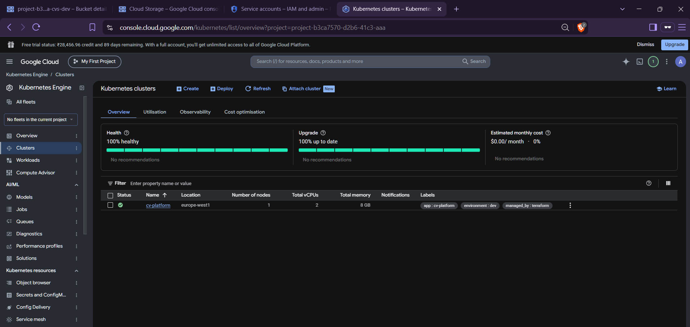

`cv-platform` cluster, 100% healthy, **1 node** (dev sizing), region `europe-west1`,
labels `environment: dev` / `managed_by: terraform`. Nodes are **private** (no public
IPs; egress via Cloud NAT) with Dataplane V2 (NetworkPolicy enforcement) and Workload
Identity enabled — see `terraform/gcp/modules/gke` and `modules/network`.

## 2. Artifact Registry — signed application images (Parts 2–4)

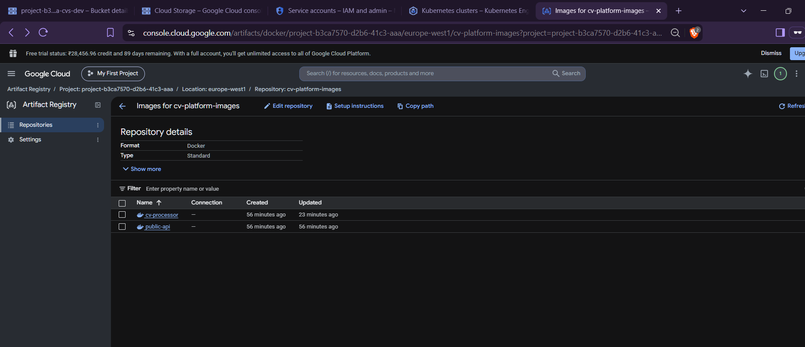

Private Docker registry `cv-platform-images` holding both hardened service images
(`cv-processor`, `public-api`). Images are distroless, non-root, digest-pinned
(Part 2) and pushed here for the GKE deployment.

## 3. Workload Identity service accounts — keyless (Part 4 — IAM)

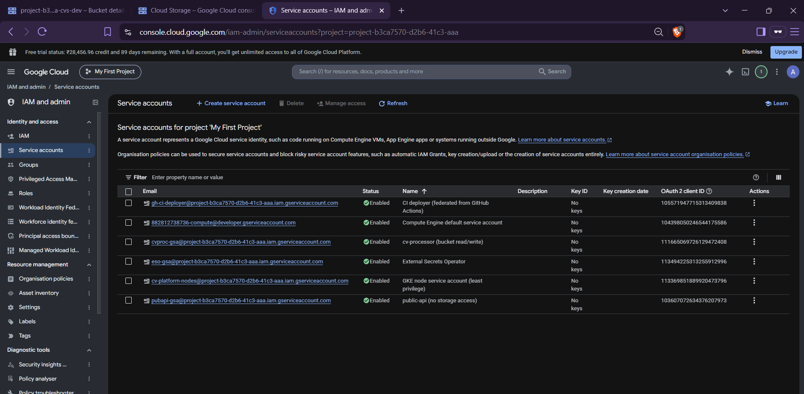

The least-privilege identity model. **Every service account has "No keys"** — access is
by Workload Identity / federation, never downloaded credentials:

| Service account | Purpose | Storage access |
| --------------- | ------- | -------------- |
| `cvproc-gsa` | cv-processor (bucket read/write) | Object Admin on CV bucket |
| `pubapi-gsa` | public-api | **none** (by design) |
| `eso-gsa` | External Secrets Operator → Secret Manager | secret accessor |
| `cv-platform-nodes` | GKE node SA | least privilege |
| `gh-ci-deployer` | CI, **federated from GitHub Actions** (WIF) | scoped |

## 4. Bucket IAM — least privilege, visually (Parts 4–5)

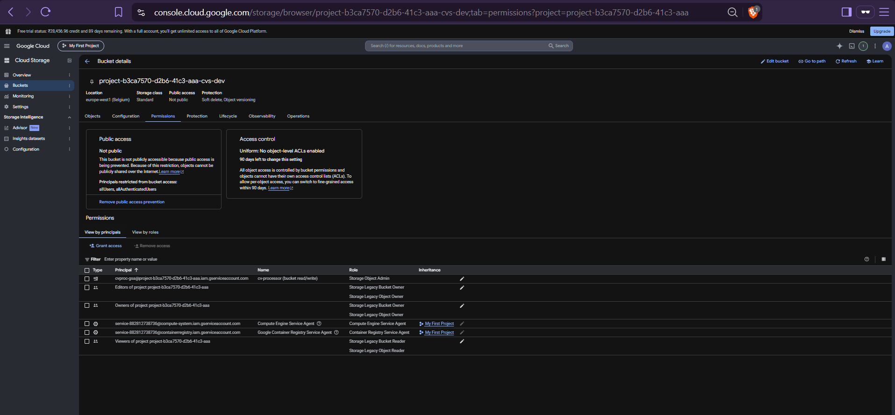

The CV bucket's **Permissions** tab. `cvproc-gsa` is granted **Storage Object Admin**;
`pubapi-gsa` **does not appear** — public-api has no path to the data. Uniform
bucket-level access is on ("No object-level ACLs enabled") and public access is
prevented ("Not public"). The remaining `Storage Legacy …` rows are GCP's default
project basic-role bindings (project Owners/Editors/Viewers — i.e. human admins); the
workload identities `pubapi-gsa` and the node SA hold no project role, so a public-api
pod is still denied. Confirmed live with a 403 — see [Runbook](RUNBOOK.md).

## 5. End-to-end proof — object written to real GCS via Workload Identity (Parts 1 & 4)

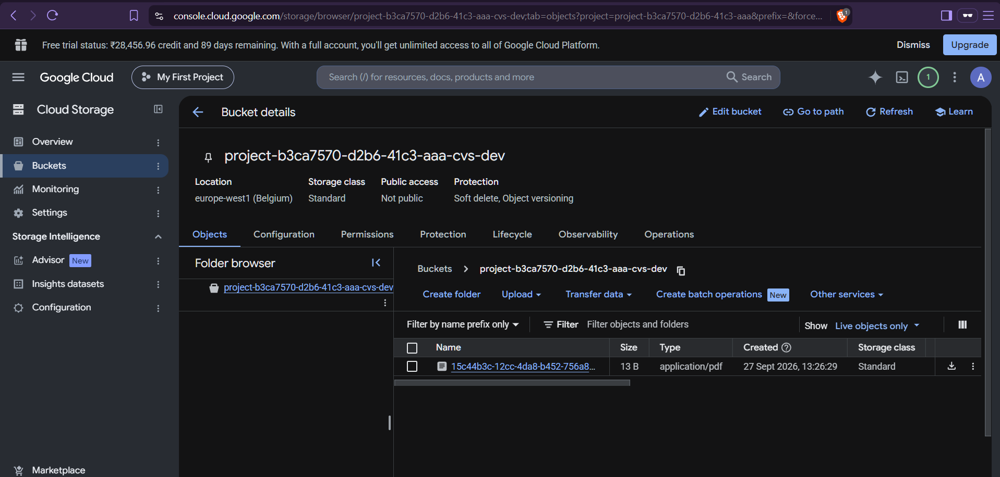

A CV uploaded to the live app (`public-api → cv-processor`) lands as a real object in
**real GCS** (`…-cvs-dev`), written by `cv-processor` using its federated identity —
**no access keys, no HMAC**. This closes the loop: the app works on GKE and the data
path is the GCP-native, keyless one described in the architecture.

---

## How these were produced (reproducible)

- **Provision:** `terraform -chdir=terraform/gcp apply -var-file=environments/dev.tfvars`
- **Deploy:** Argo CD syncs `deploy/gke/` from Git (GitOps) — `Application cv-platform-gke`, Synced/Healthy.
- **Secrets:** External Secrets Operator syncs the DB credential from Secret Manager via `eso-gsa` (Workload Identity) into `cv-db-credentials`.
- **Least-privilege proof (live):** two throwaway pods, one per KSA, listing the bucket — `cv-processor` allowed, `public-api` denied (403). Exact commands in [RUNBOOK.md](RUNBOOK.md).

---

## 6. GitOps CD — Argo CD app-of-apps + CI deploy-by-digest (Parts 3 & 4)

The GKE target is deployed by **Argo CD** from per-service **Helm charts**, wired as an
**app-of-apps**: a root `cv-platform` Application manages two child Applications
(`cv-platform-frontend`, `cv-platform-backend`). The running version is always a
**cosign-signed image digest** that **CI** pinned into `values-dev.yaml` and committed
(note the sync author `ci-deployer[bot]` and comment `[skip ci] deploy: pin image
digests …`). Git is the single source of truth for both config and the exact deployed
artifact.

![Argo CD app-of-apps: root cv-platform -> frontend + backend, Synced/Healthy, last sync by ci-deployer[bot] pinning image digests](screenshots/06-argocd-app-of-apps-root.png)

*Root app-of-apps: one root Application fans out to the two per-service child apps; last
sync is the CI digest-pin commit.*

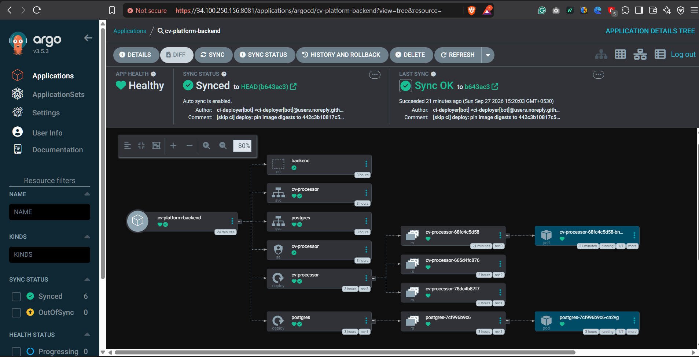

*Backend chart resource tree — all Synced/Healthy. The current ReplicaSet (`rev:3`) is the
rollout to the CI-pinned digest.*

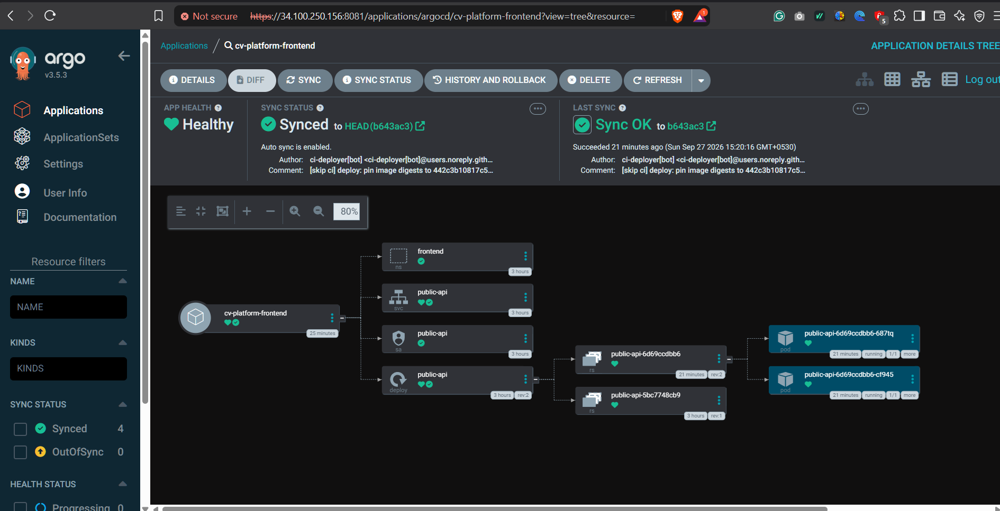

*Frontend chart resource tree — public-api with 2 running replicas, Synced/Healthy.*

**Pipeline (proven end-to-end):**
`git push` → CI test/scan → build to Artifact Registry `:<sha>` → SBOM + Trivy gate +
cosign keyless sign → pin `@sha256` digests into `deploy/helm/*/values-dev.yaml` →
`[skip ci]` commit → Argo CD syncs the two apps to the signed digests. Cloud auth
throughout is **Workload Identity Federation** (no static keys).

---

## 7. NetworkPolicies on GKE — ingress segmentation (Part 4/5)

Live on GKE: `default-deny-ingress` in both namespaces, plus per-service ingress
allows — `cv-processor` reachable only from `public-api` (frontend), `postgres`
only from `cv-processor`. Verified live: an upload through `public-api` succeeds
(`201`), while a rogue pod in `frontend` calling `cv-processor:8081` is **denied**
(connection times out).

**Egress note (platform limitation, deliberate).** A strict *egress* default-deny
is enforced and proven on the local **kind** cluster (`make verify` checks that
`cv-processor` cannot reach the internet). On **GKE**, the cluster runs Dataplane V2
(managed Cilium) with **NodeLocal DNSCache**: pods resolve via the kube-dns ClusterIP
which is intercepted to the node (`host`) identity. Standard Kubernetes NetworkPolicy
`ipBlock` rules cannot match `host`/cluster-internal identities, and the
`CiliumNetworkPolicy` CRD that could (`toEntities: [host]`) is not exposed on GKE
Dataplane V2. A strict egress default-deny therefore breaks DNS on GKE. We enforce
**ingress** segmentation on GKE and keep the egress "no-internet" control on kind;
the production-hardened egress path for GKE is Private Google Access via the
restricted VIP (`199.36.153.4/30`), documented in the backend chart values.

---

## 8. Autoscaling & disruption budgets (production-ready, live)

Both services run an HPA and a PDB, defined in the per-service Helm charts and
managed by Argo CD.

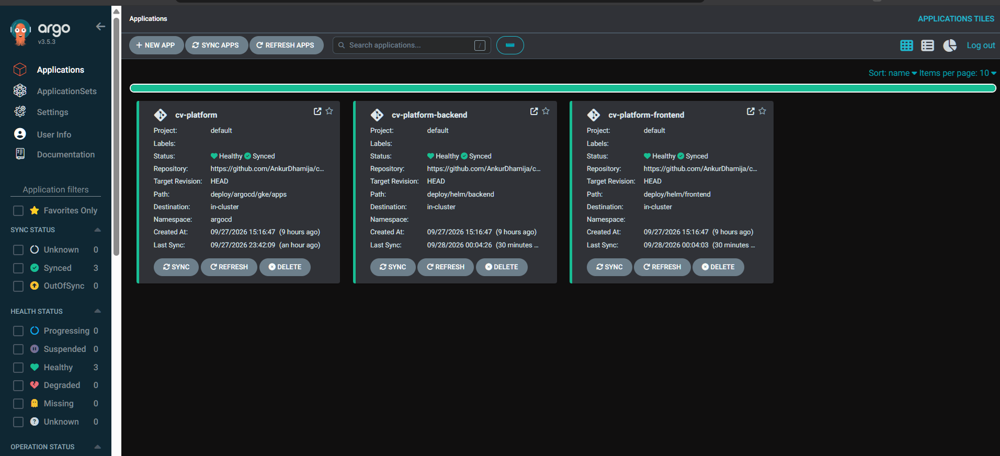

*Root `cv-platform` fans out to `frontend` + `backend` — all Synced/Healthy.*

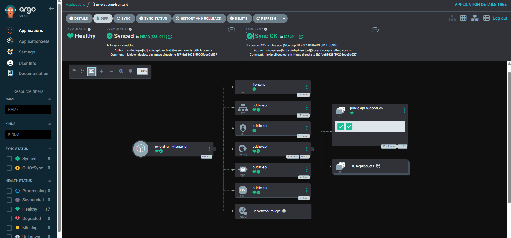

*public-api tree: `hpa` + `pdb` live. Last sync authored by `ci-deployer[bot]`,
`[skip ci] deploy: pin image digests to fb7fde…` — the automated deploy-by-digest loop.*

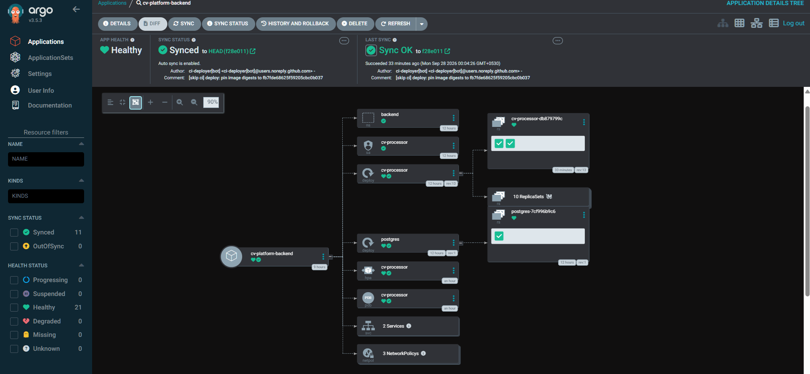

*cv-processor tree: `hpa` + `pdb` + 3 NetworkPolicies live, synced to the CI-pinned digest.*

---

## `make verify` — local (kind) vs GKE

(b) security-context, (c) public-api->cv-processor, (d) egress-blocked, (e) segmentation
pass on kind. **(a) signature verification runs in Audit on kind** (in-cluster Kyverno
can't reach the host-local registry) and is **Enforced on GKE** with Artifact Registry +
keyless cosign.

## Live re-verification — 2026-09-28

End-to-end proof after a clean rebuild and a live GKE deploy.

### Security controls (a)–(e) — `make verify`
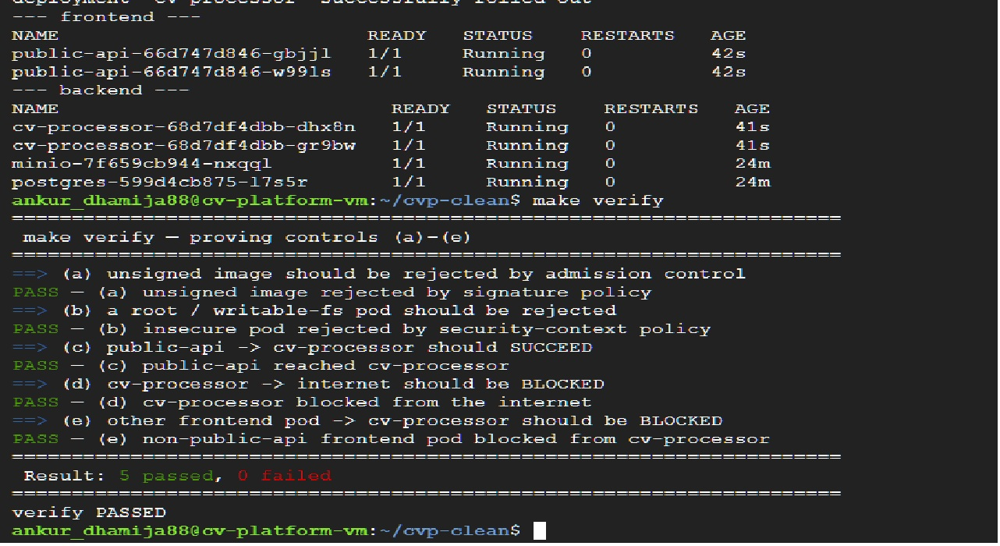
Unsigned image rejected, insecure securityContext rejected, public-api→cv-processor allowed,
cv-processor→internet blocked, and a non-public-api frontend pod blocked from cv-processor.

### SLOs & observability (Grafana)
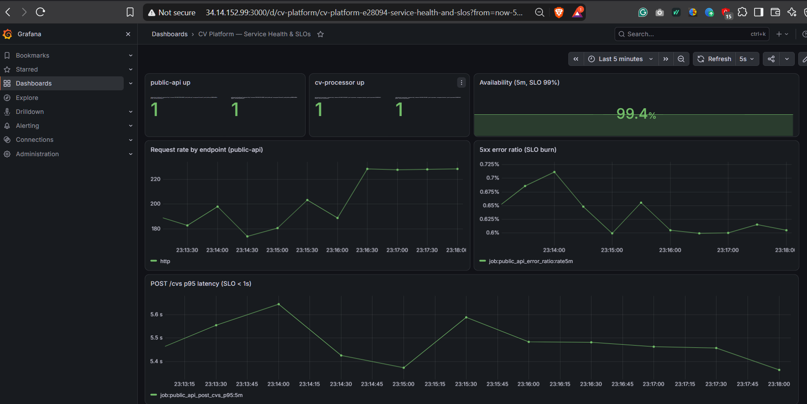
Both services `up`; availability 99.4% against the 99% SLO; 5xx burn-rate and POST /cvs p95 latency panels populated.

### GKE — GitOps, External Secrets, ingress
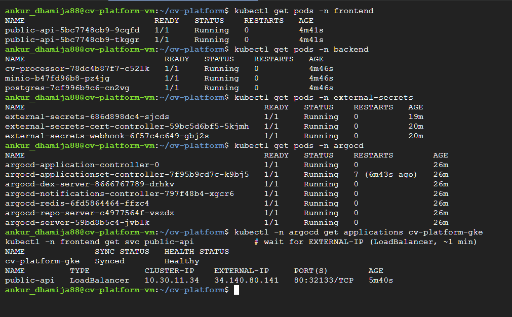
frontend/backend workloads Running; **External Secrets Operator** syncing the DB credential from Secret Manager;
Argo CD `cv-platform-gke` Synced/Healthy; `public-api` exposed via LoadBalancer (34.140.80.141).

## Update — 2026-09-29 (clean rebuild)

After a full `terraform destroy` + `apply` and a fresh GitOps bring-up, the current
live state is captured below. (A few specifics differ from the dated screenshots
above: the root Argo app is `cv-platform`, not `cv-platform-gke`, and the
`public-api` LoadBalancer IP is assigned per deploy — currently `34.78.202.187`.)

### Kyverno — hardened securityContext enforced live on GKE
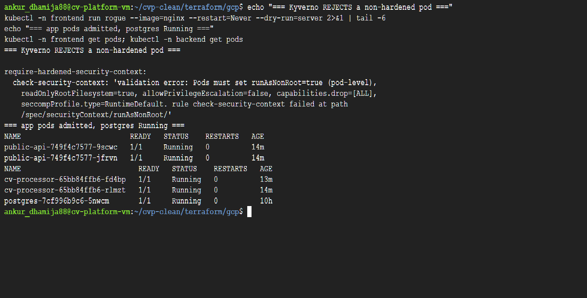

The `require-hardened-security-context` ClusterPolicy runs in **Enforce** on GKE
(installed via Argo CD). A rogue non-hardened pod is **rejected** with the policy
message; the signed, hardened app pods and the exempt `postgres` keep running.

### CI — post-deploy validation + automated rollback
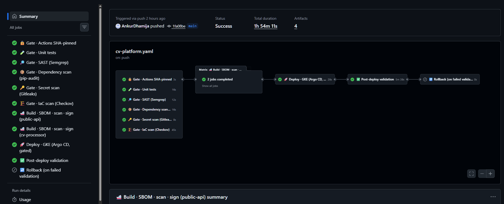

End-to-end green run: gates -> build/SBOM/scan/keyless-sign -> deploy-by-digest ->
**post-deploy validation** (rollout health + LB smoke test) -> **rollback** skipped.

### GitOps — Argo CD app-of-apps, Kyverno managed by GitOps
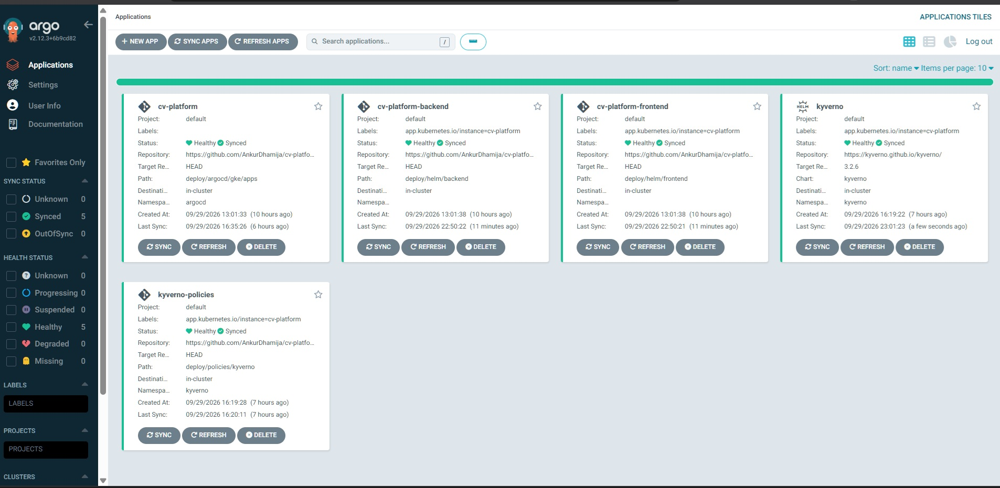

Root `cv-platform` (-> `cv-platform-backend` + `cv-platform-frontend`) plus
`kyverno` and `kyverno-policies`, all **Synced / Healthy** — Kyverno is installed
and reconciled by Argo CD, not by hand.

### ESO identity codified in Terraform
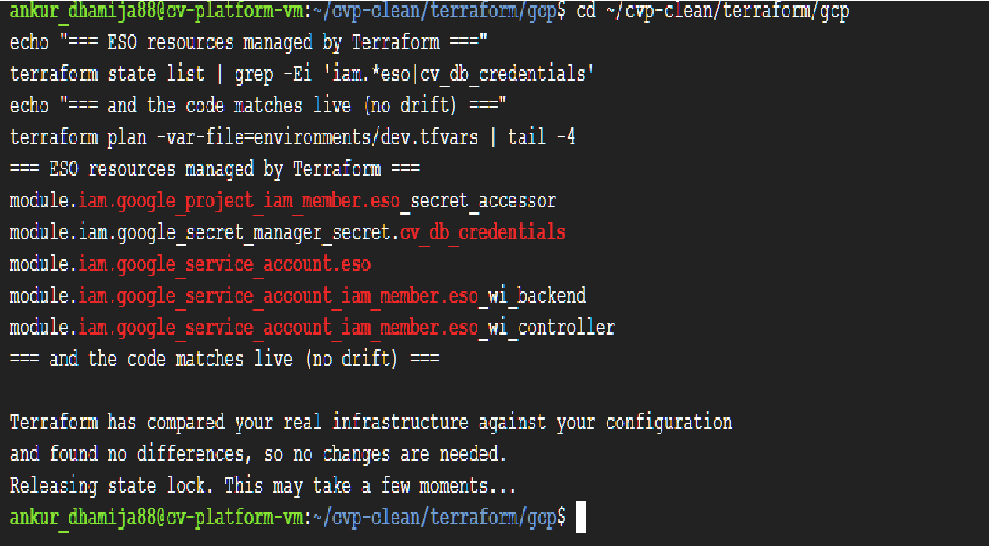

`eso-gsa`, its `secretmanager.secretAccessor`, both Workload Identity bindings, and
the `cv-db-credentials` secret container are Terraform-managed; `terraform plan`
reports **no changes** (no drift). The secret *value* stays out-of-band.
